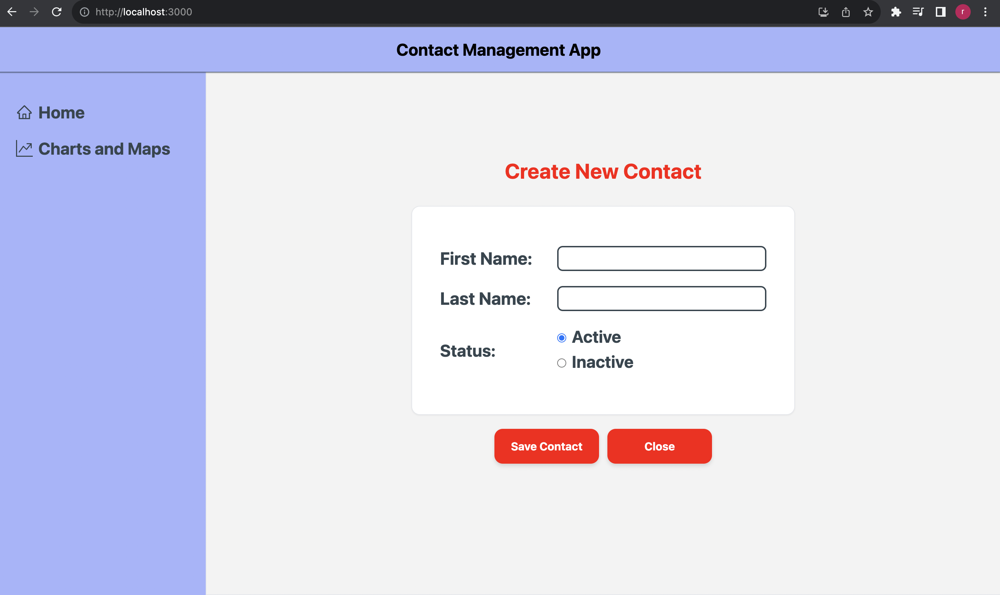
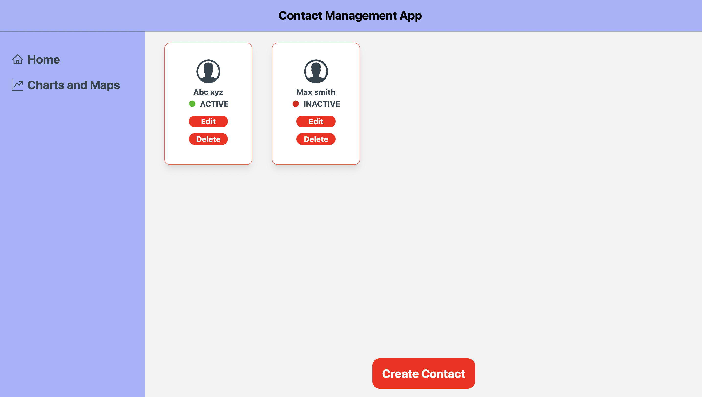
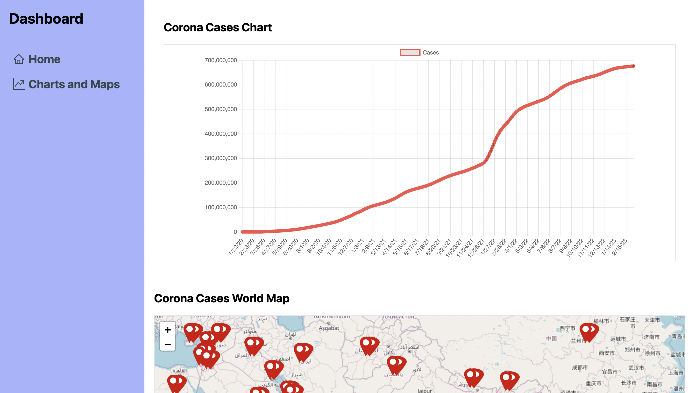
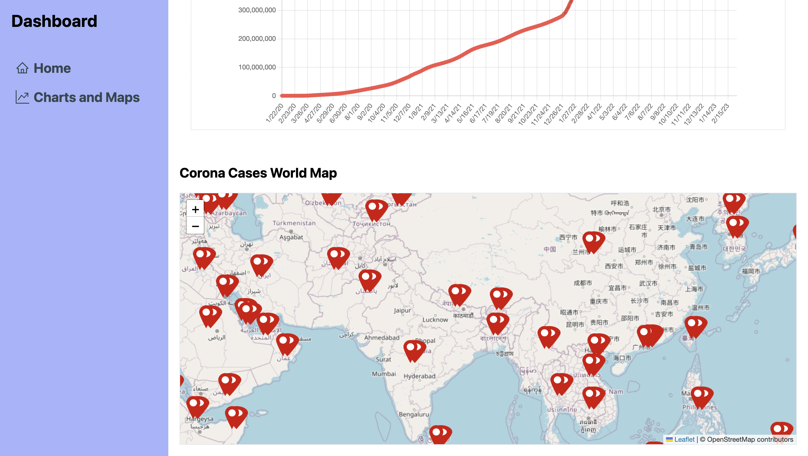

# Contact Management App

This is a contact management app with charts and maps, built using React TypeScript, React Router v6,TailwindCSS and other libraries. The app allows you to add new contacts, display a list of all added contacts, view contact details, edit and delete contacts. It also has a simple dashboard with a line graph showing the cases fluctuations and a react leaflet map with markers which indicates the country name, total number of active, recovered cases and deaths in that particular country as a popup.

## Features
### Contacts Page
- A form for adding new contacts
- Redux is used to store the contact data
- A list of all added contacts
- A button to view the contact details
- The app is able to edit and delete contacts

### Charts and Maps Page
- A react leaflet map with markers which indicate the country name, total number of active, recovered cases and deaths in that particular country as a popup.
- A line graph displaying the cases fluctuations

### API's Used
- World wide data of cases: https://disease.sh/v3/covid-19/all
- Country Specific data of cases: https://disease.sh/v3/covid-19/countries
- Graph data for cases with date: https://disease.sh/v3/covid-19/historical/all?lastdays=all

### Libraries Used
- React-redux for state management
- TypeScript for type check
- React Hooks for Functional Components.
- useState hooks used for state change in Charts and useHooks to update the UI when data being fetched.
- Tailwind CSS for styling
- react-leaflet and leaflet for world map
- React-chartjs-2 for line chart
- React icons for icons
- React query to handle API Calls and data mangement

## Deployment
I've used Vercel for deployement.Click on the below link to get preview.
https://contact-management-app-ivory.vercel.app/

## Installation
1.Clone the repository: git clone https://github.com/your-username/your-repo-name.git
2.Install dependencies: yarn install or npm install

## Running the App
1.Start the development server: yarn start or npm start
2.Open your browser and go to http://localhost:3000

## Example Screenshots

## Conclusion
This app is a simple and responsive contact management app with charts and maps. It allows you to add, view, edit and delete contacts. It also has a dashboard with a line graph and a world map that shows the COVID-19 cases data. The app is built using ReactJS, TypeScript, TailwindCSS, React Router v6, and React Query aka TanstackQuery.
